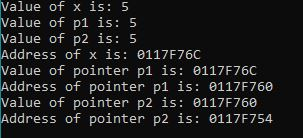
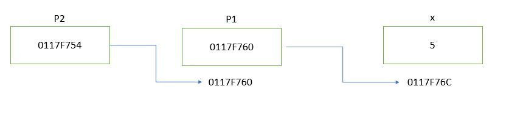

# Deeper Understanding of Pointers
## What is a pointer?     
A pointer is a variable that can store/point to a memory address of a different variable. A variable that is indicated as a pointer has a "*" before the variable name. An example of how pointers are used and visualized are shown below:
```angular2
int x = 5;
int* p;
p = &x;

cout << "Address of x is: " << &x << endl;
cout << "Value of x is: " << x << endl;
cout << "Value of p is: " << *p << endl;

cout << "Value of pointer p is: " << p << endl;
cout << "Address of pointer p is: " << &p << endl;
```
Output:     


The value of pointer P is referencing the memory address of variable x. This explain why the value stored in p is equal to the value of x.

Illustration:       

## Pointers can be reference to other pointers
A pointer can be pointed towards another pointer that is pointed towards a variable. The logical assumption of pointers referencing pointers is shown below:

```angular2
x == *p1 == **p2
&x == p1 == *p2
&p1 == p2
```

An example and illustration of a pointer -> to another pointer is shown below:
```angular2
int x = 5;
int* p1;
int** p2;
p1 = &x;
p2 = &p1;
    
cout << "Value of x is: " << x << endl;
cout << "Value of p1 is: " << *p1 << endl;
cout << "Value of p2 is: " << **p2 << endl;
cout << "Address of x is: " << &x << endl;
cout << "Value of pointer p1 is: " << p1 << endl;
cout << "Address of pointer p1 is: " << &p1 << endl;
cout << "Value of pointer p2 is: " << p2 << endl;
cout << "Address of pointer p2 is: " << &p2 << endl;
```
Output:     


Illustration:       

## Relation between array and pointer
The most common way that pointers are utilized is through arrays. An array is considered as a list of elements where each element of an array points to an address locations that is ordered arithmetically based on the datatype.
For example these two initialization are the same:
```angular2
int* arr = new int[5]; == int* arr = (int*)malloc(5 * sizeof(int));

arr[1] == *(arr + 1)
```
This simple code below shows that arrays are consider pointers.
```angular2
int* arr = (int*)malloc(5 * sizeof(int));
for (int i = 0; i < 5; i++) {
    *(arr + i) = i;
}
for (int j = 0; j < 5; j++) {
   cout << arr[j] << " ";
}
```
Output:


Even though the values was stored through pointers, the values were printed through array.
## malloc() vs calloc() and free()
There are two ways to allocate memory
### 1. malloc(size_t size)
size: size of the block in bytes        
malloc() dynamically allocates a block of memory of a given data type in bytes. It returns a void type pointer which can be casted to any data type.

```angular2
// The size for data type int is 4 bytes
int* arr = (int*)malloc(5 * sizeof(int));
```
illustration:       


### 2. calloc(size_t num, size_t size)
num: total number of blocks         
size: size of a block in bytes          
calloc dynamically allocates the requested memory size in blocks and return a pointer of type void

```angular2
// The size for data type int is 4 bytes
int* arr = (int*)calloc(5, * sizeof(int));
```
Illustration:       


### 3. Difference
Ideally malloc() and calloc do the same thing, the only differences are
1. Malloc doesn't initialize the memory allocation where as calloc initializes the allocated memory to zero.
2. Malloc is technically faster because it doesn't require that initialization step, however the difference in speed is not noticeable.
### 4. Free(size_t* ptr)
After your done with using the allocated memory, it is best to deallocate the memory so it helps reduce waste of memory by freeing it.
```angular2
free(arr);
```
## How mapping address work for a 2D matrix
There are two ways you can allocate the memory if wanted to view things in 2D
### 1. View the mapping of addresses of a matrix as a 2D array
This method of allocating memory for a 2D matrix allocates the column first, then allocates the number of columns per row. The content and the result is shown below:
```angular2
int n = 3;
double** L = (double**)malloc(n * sizeof(double*));
for (int i = 0; i < n; i++) {
    L[i] = (double*)malloc(n * sizeof(double));
}
```
However with this method, it will result where the memory address for the starting point of each row isn't iterable from the end of the previous row

```angular2
for (int i = 0; i < n; i++) {
        for(int j = 0; j < n; j++)
            cout << "for i: " << i << " and j: " << j << ", Address is " << &L[i][j] << endl;
}
```
Output:


Also freeing the memory is more complicated because the addresses aren't connected between each row of the matrix
```angular2
for (int i = 0; i < n; i++) {
    free(*(L + i));
}
free(L);
```

### 2. View the mapping of addresses of a matrix as an 1D array
This method is the efficient approach in memory allocation of a 2D matrix because you view a 2D matrix as a vector so that accessing element is convenient and freeing the memory is easier. 
An example of this is shown below:

Lets say you have a NxM matrix you want to allocate in memory. You allocate memory of up to N x M x sizeof(datatype).
```angular2
int N = 3;
int M = 4;
int Matrix[N][M] = {{1, 2, 3, 4}, {5, 6, 7, 8}, {9, 10, 11, 12}};
int* K = (int*)malloc((int)(N*M)*sizeof(int));

for (int i = 0; i < N; i++){
   for (int j = 0; j < M; j++){
        *(K + i * M + j) = Matrix[i][j];
        cout << "On Address " << (K + i * M + j) << ": " << *(K + i * M + j) << endl;
   }
}
free(K);
```
We can see that from the addressed that stores the 3x4 Matrix that, for each element, each element of the matrix is registered to each address that is iterable by 4 from the previous element.

Output:


## Involving Images         
When working with image files, it is best to understand how it is written and start reading the file where the first pixel is located.
When allocating the pixel values of the image, it is best to allocate memory for each RGB channel. The mathematics of locating memory while doing computation with pixel intensities get tricky when combining all the pixels values as a big list.

The example that we are going to work with involve using a PPM file. There a website called "hexed.it" where it shows how the ppm file is actually written. From the image shown below, the highlighted area on the image is where the first pixel is for the red channel and the pixels are ordered (r,g,b). Usually the image files contain information before the image content like what type of file it is, the provider, width, height, and max intensity.


The example below shows how to read and write a PPM file. The code takes in an input .ppm image file and reads the content of it. Allocates memory for pixel intensities of each color channel seperately and write the same image. The idea of this program is just to take into consideration of seperating the pixel values for each color channel correctly so that you can apply image processing techniques, like 2D convolution or rotation, more effectively.
```angular2
#include <string>
#include <fstream>
#include <math.h>
#include <time.h>
#include <iomanip>
#include <stdio.h>
#include <stdlib.h>
#include <iostream>
using namespace std;

int main(int argc, char** argv) {
    double intensity = 0;
    unsigned int_index = 0;
    char buffer[20];
    std::ifstream infile;
    std::ofstream outfile;
    std::ofstream outfile2;
    std::string filename = "hereford_512.ppm";
    char initial[6];
    char comment[50];
    double width;
    double height;
    double max_intense;
    char output[50] = "hereford_512_output.ppm";
    infile.open(filename.c_str(), ios::in | ios::app | ios::binary);
    if (!infile) {
 	    cout << "file not detected" << endl;
	    exit(1);
	}
    infile.seekg(0, infile.beg);
    infile.getline(initial, 6);
    infile.getline(comment, 50);
    infile.getline(buffer, 20, ' ');
    width = (double)atoi(buffer);
    infile.getline(buffer, 20);
    height = (double)atoi(buffer);
    infile.getline(buffer, 20);
    max_intense = (double)atoi(buffer);
    double* pixel_data = (double*)malloc(width * height * 3 * sizeof(double));
    double* data_red = (double*)malloc(width * height * sizeof(double));
    double* data_green = (double*)malloc(width * height * sizeof(double));
    double* data_blue = (double*)malloc(width * height * sizeof(double));

    while (!infile.eof()){
        intensity = (double)infile.get();
        if (intensity == -1) break;
        *(pixel_data + int_index) = (double)intensity;
        int_index++;
	}
    for (int i = 0; i < (width * height); i++){
        *(data_red + i) = *(pixel_data + i * 3);
        *(data_green + i) = *(pixel_data + i * 3 + 1);
        *(data_blue + i) = *(pixel_data + i * 3 + 2);
    }

    outfile.open(output, ofstream::out | ofstream::app | ofstream::binary);
    outfile << "P6\n";
    outfile << width << " " << height << "\n";
    outfile << max_intense << "\n";
    for (int i = 0; i < (width * height); i++){
        outfile << (unsigned char)*(conv_red + i);
        outfile << (unsigned char)*(conv_green + i);
        outfile << (unsigned char)*(conv_blue + i);
    }
    outfile << EOF;
    infile.close();
    outfile.close();
    free(pixel_data);
    free(data_red);
    free(data_green);
    free(data_blue);
}	

```

# Resources and additional information
1. https://www.geeksforgeeks.org/dynamic-memory-allocation-in-c-using-malloc-calloc-free-and-realloc/?ref=lbp
2. https://www.youtube.com/watch?v=M0Df1nu2vDg&ab_channel=ProgrammerTube
3. https://www.freecodecamp.org/news/data-structures-101-arrays-a-visual-introduction-for-beginners-7f013bcc355a/
4. https://www.tutorialspoint.com/cprogramming/c_data_types.htm
5. https://www.geeksforgeeks.org/dynamically-allocate-2d-array-c/
